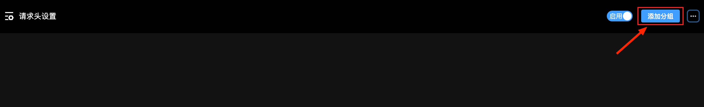
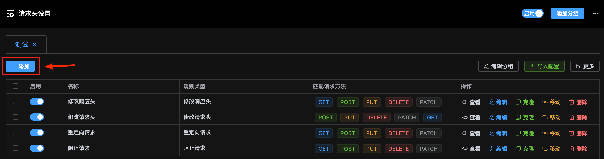
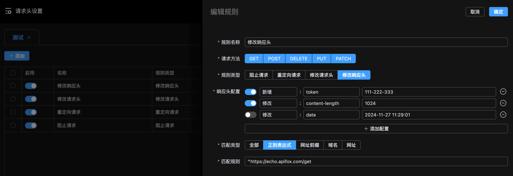
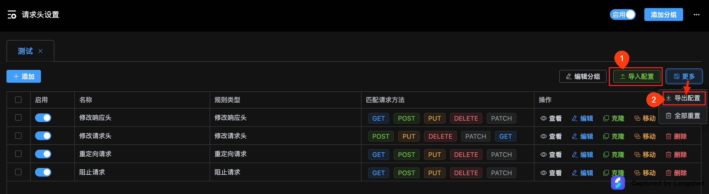

# 添加、编辑分组

# 添加、编辑规则

1. 点击 `添加` 按钮, 进入编辑页面。

2. 编辑规则

> **注意:**
>
> - 规则类型为 `网址前缀` 和 `域名` 时, 匹配规则不能以 `https` 或 `http` 开头, 如: `www.example.com` 或 `test.example.com`
> - 规则类型为 `域名` 时, 匹配规则支持多个配置, 以英文逗号分隔

# 导入导出配置

> 在导入配置时, 需要选择导入至的分组（没有时需先创建分组）。

