# 添加、编辑项目

1. 点击 `项目列表` 右上角的 `添加项目` 按钮, 进入编辑页面

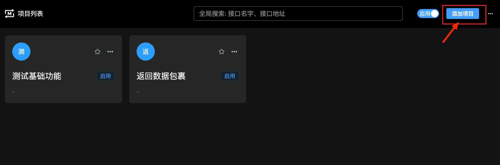

2. 也可以点击 `项目列表` 具体某个项目的右上角更多入口, 选择 `编辑项目`, 进入编辑页面

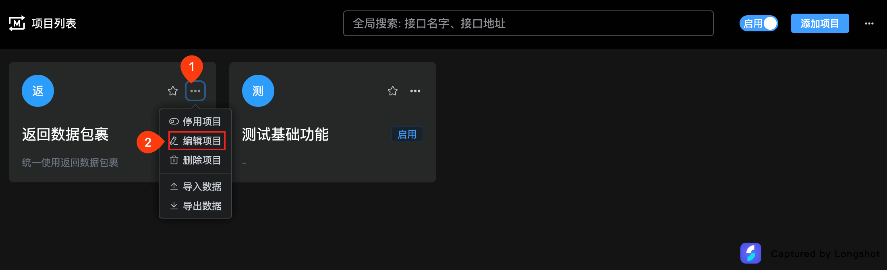

3. 编辑项目信息, 点击 `保存` 按钮

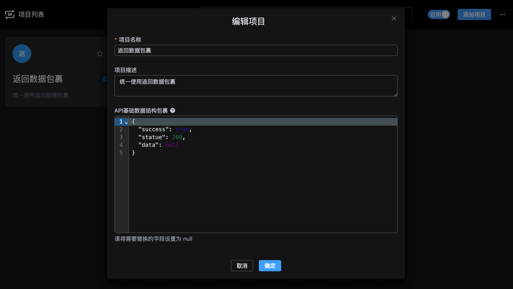

**说明:**

> - `API基础数据结构包裹` 用于配置 API 的基础数据结构, 会将 data 字段下的 null 替换为自动生成的 Mock 数据。如果接口定义中有定义同类型字段，该配置会覆盖自动生成的对应字段。

例如：

```ts
// API基础数据结构包裹 配置
{
  "code": 200,
  "message": "成功",
  "success": true,
  "data": null
}
```

**场景一: 返回无同样结构的 Mock 数据**

```ts
// Mock 数据
{
  "list": [{}, {}],
  "total": 2,
  "pageSize": 10,
}

// 最终返回数据
{
  "code": 200,
  "message": "成功",
  "success": true,
  "data": {
    "list": [{}, {}],
    "total": 2,
    "pageSize": 10,
  }
}
```

**场景二: 返回有同样结构的 Mock 数据**

```ts
// Mock 数据
{
  "code": 400,
  "message": "这是Mock数据",
  "success": true,
  "data": {
    "list": [],
    "total": 101,
    "pageSize": 25,
  }
}

// 最终返回数据
{
  "code": 400,
  "message": "这是Mock数据",
  "success": true,
  "data": {
    "list": [],
    "total": 101,
    "pageSize": 25,
  }
}
```

# 导入、导出项目配置

1. 点击 `项目列表` 右上角 `导入项目` 按钮, 进入导入选择页面。也可以点击 `项目列表` 具体某个项目的右上角更多入口, 选择 `导入数据`, 给当前项目项目导入配置

**`导入项目` 入口**

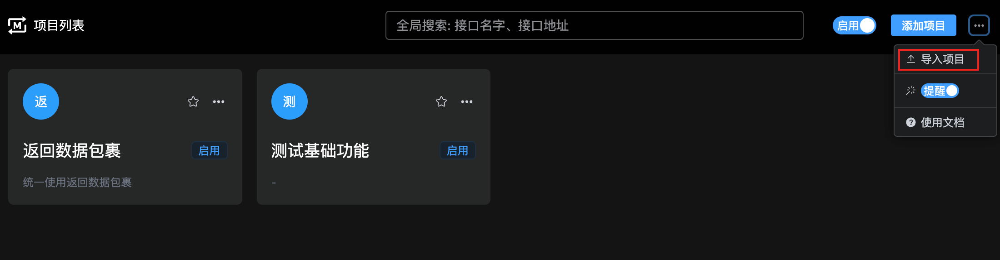

**`导入数据` 入口**

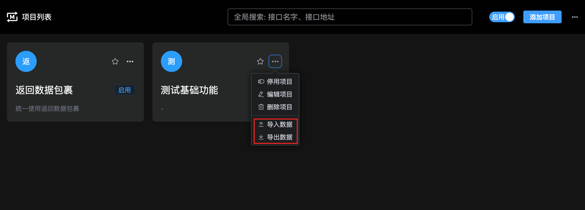

2. 选择导入的类型: `新建项目` 或 `选择已有项目`

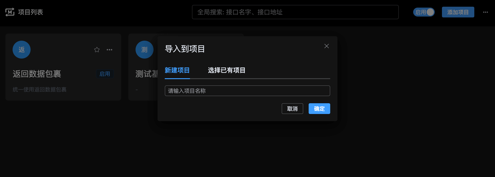

> **说明:**
>
> - 如果是从某个项目右上角更多入口, 选择`导入数据`给当前项目导入配置不会显示该弹窗, 其相对于`选择已有项目`会直接进入下一步的设置页面

3. 选择要导入的数据 及 处理`匹配到相同接口`时的处理策略（导入已有项目时才有）

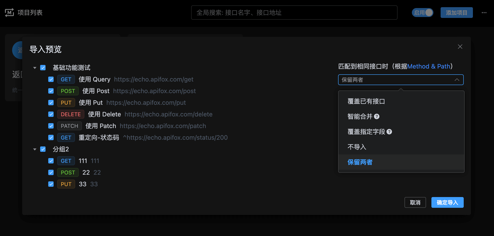

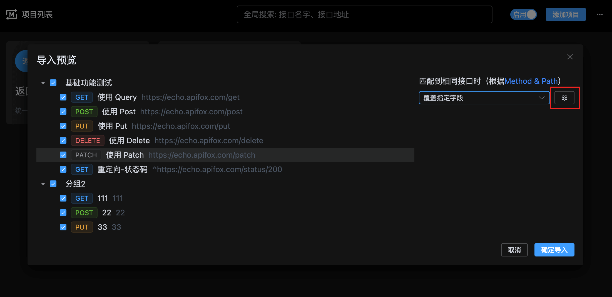

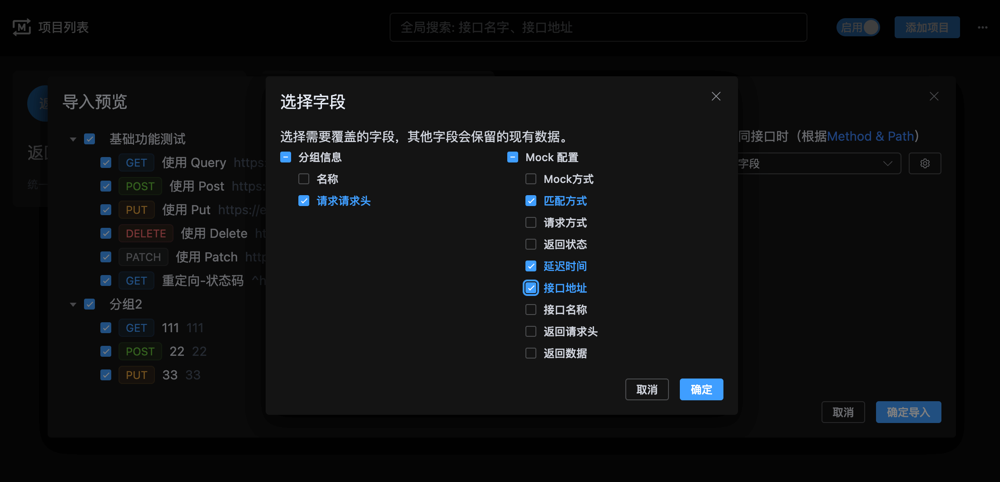

# 添加、编辑分组

1. 在项目分组页面, 点击右上角的 `添加分组` 或 当前分组规则列表的`编辑分组` 按钮, 进入编辑页面

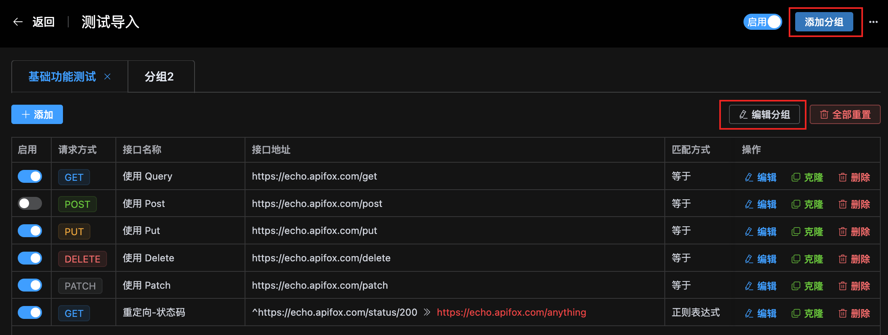

2. 编辑分组信息, 点击 `保存` 按钮

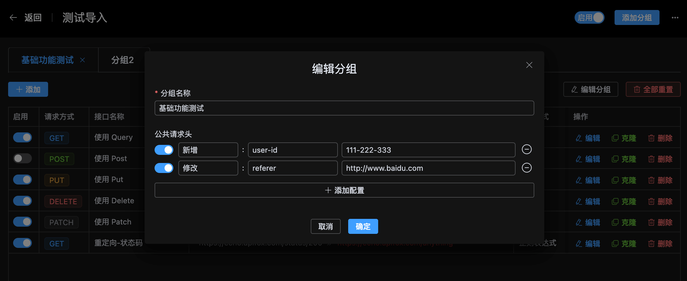

# 添加、编辑规则

1. 点击当前分组规则列表的 `添加` 按钮 或 某个规则的 `克隆`、`编辑`按钮, 进入编辑页面

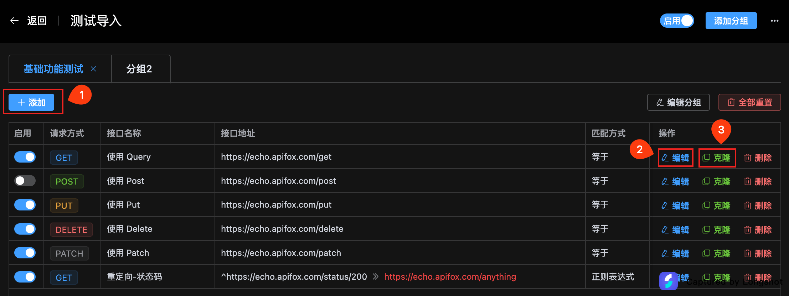

2. 编辑规则信息, 点击 `保存` 按钮

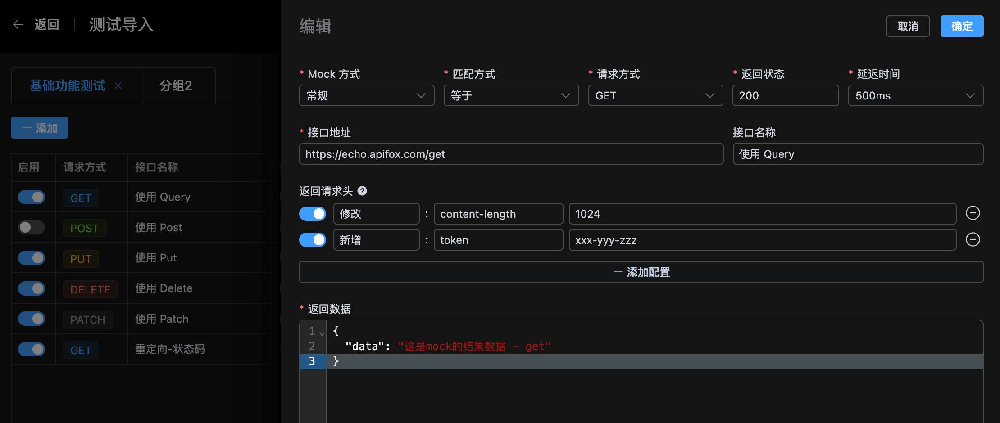

# Mock 开/关、是否显示 Mock 的 Toast 开/关

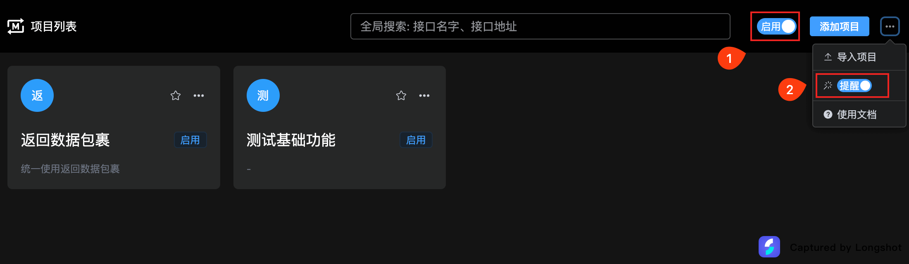

> **说明:**
>
> 1. 标注 ① 是 `Mock 开/关`, 用于控制是否开启 Mock 功能
> 2. 标注 ② 是 `是否显示 Mock 的 Toast 开/关`, 用于控制是否在请求成功后在页面右下角显示 Mock 结果
> 3. 也支持单个项目的 Mock 开/关功能, 点击项目进入到项目的规则列表, 点击右上角 `Mock 开/关即可

**toast 效果**

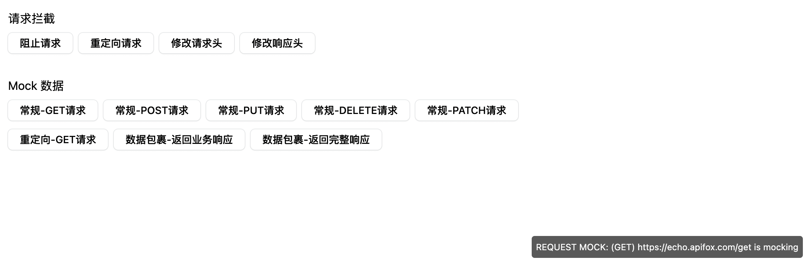
