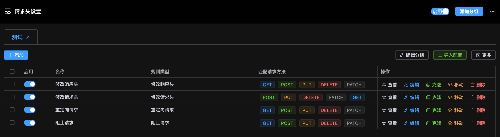
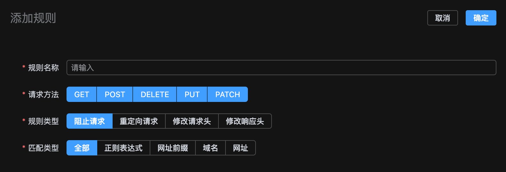
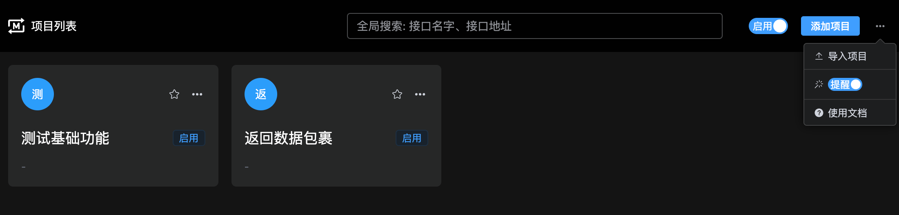
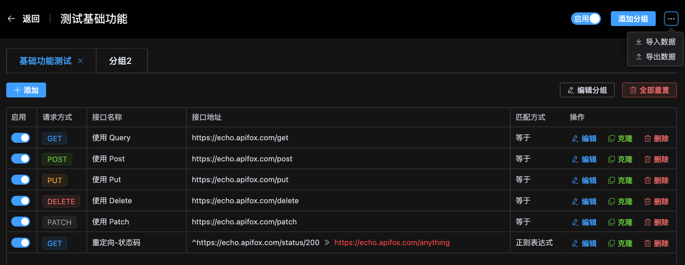
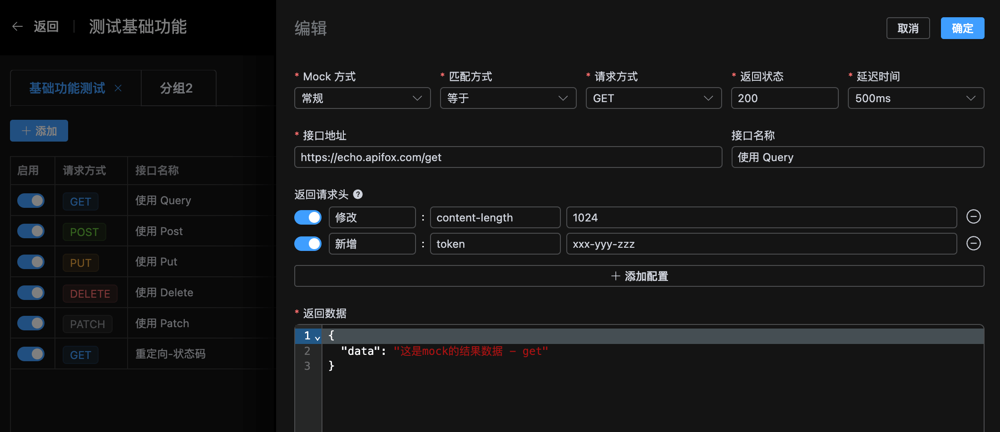

# Network Intercept

网络拦截工具, 用于调试、mock 接口响应数据。功能模块有以下几个:

- 拦截网络请求, 设置请求头
- 拦截 Fetch、XMLHttpRequest 发起的请求, Mock 响应数据

## 设置请求头

通过设置请求头, 实现阻止请求、重定向请求、新增或修改请求头、新增或修改响应头, 下图为主要功能截图。 具体用法请看[使用文档](.guide/headers.md)。

**1. 分组列表**

**2. 添加、编辑请求头规则**

## Mock 响应数据

通过设置响应的 Mock 规则, 拦截 Fetch、XMLHttpRequest 发起的请求直接返回自定义数据, 下图为主要功能截图。 具体用法请看[使用文档](.guide/mock.md)。

**1. 项目列表**

**2. 分组、规则列表**

**3. 添加、编辑规则**

